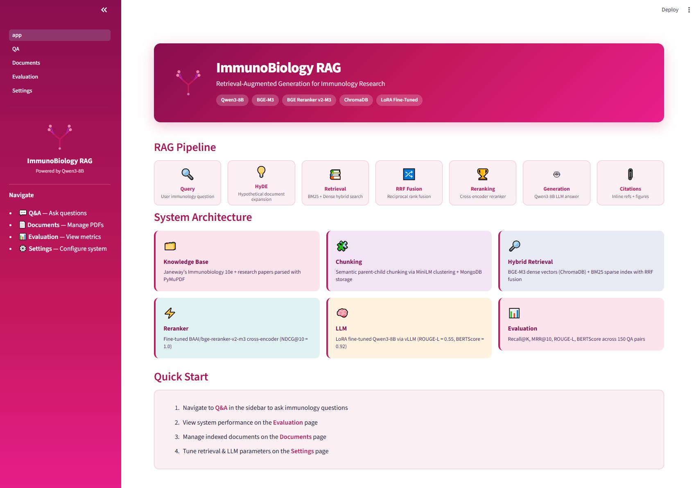
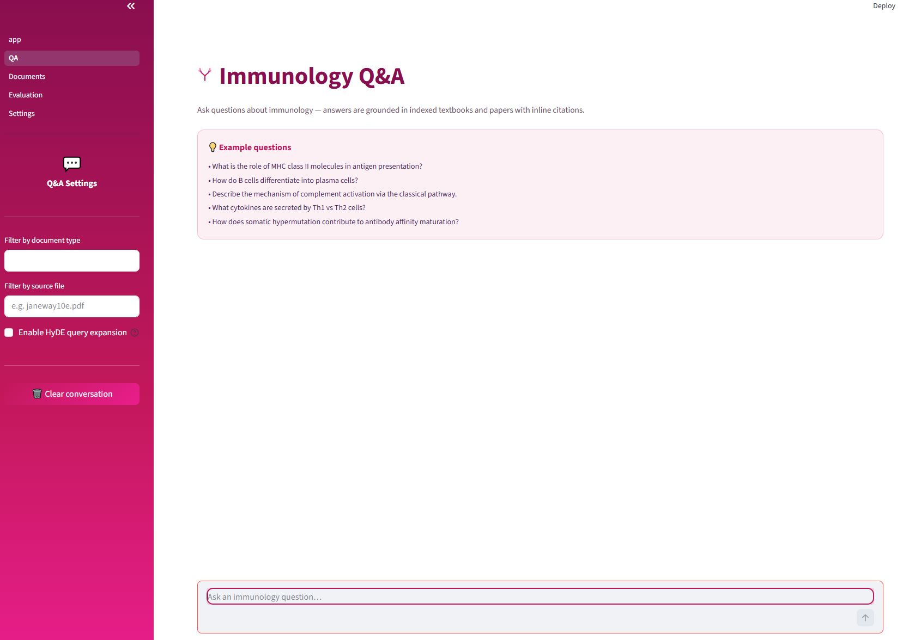
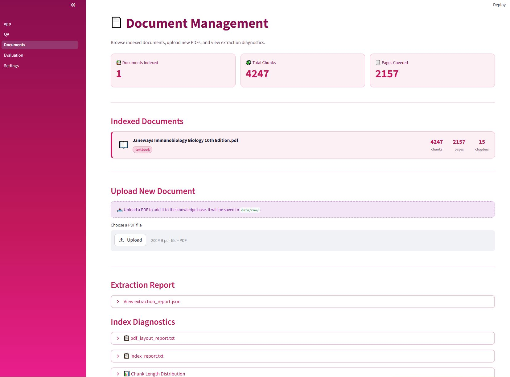
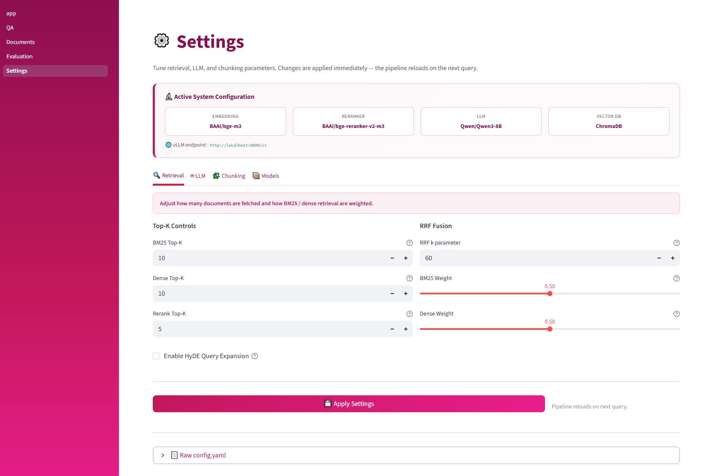

<div align="center">

<!-- Antibody SVG logo -->
<svg width="80" height="80" viewBox="0 0 200 200" xmlns="http://www.w3.org/2000/svg">
  <line x1="100" y1="115" x2="100" y2="178" stroke="#C2185B" stroke-width="10" stroke-linecap="round"/>
  <line x1="58"  y1="78"  x2="100" y2="115" stroke="#C2185B" stroke-width="10" stroke-linecap="round"/>
  <line x1="142" y1="78"  x2="100" y2="115" stroke="#C2185B" stroke-width="10" stroke-linecap="round"/>
  <line x1="28"  y1="50"  x2="58"  y2="78"  stroke="#E91E8C" stroke-width="7" stroke-linecap="round"/>
  <line x1="36"  y1="26"  x2="58"  y2="78"  stroke="#9C27B0" stroke-width="7" stroke-linecap="round"/>
  <line x1="172" y1="50"  x2="142" y2="78"  stroke="#E91E8C" stroke-width="7" stroke-linecap="round"/>
  <line x1="164" y1="26"  x2="142" y2="78"  stroke="#9C27B0" stroke-width="7" stroke-linecap="round"/>
  <circle cx="28"  cy="50"  r="10" fill="#F48FB1"/>
  <circle cx="36"  cy="26"  r="10" fill="#F48FB1"/>
  <circle cx="172" cy="50"  r="10" fill="#F48FB1"/>
  <circle cx="164" cy="26"  r="10" fill="#F48FB1"/>
  <circle cx="100" cy="178" r="8"  fill="#CE93D8"/>
</svg>

# ImmunoBiology RAG

**Retrieval-Augmented Generation for Immunology Research**

[](https://python.org)
[](https://pytorch.org)
[](https://streamlit.io)
[](https://github.com/vllm-project/vllm)
[](LICENSE)

*Ask immunology questions. Get answers grounded in real textbooks. With citations.*

</div>

---

## Overview

ImmunoBiology RAG is a production-ready **Retrieval-Augmented Generation** system built for immunology Q&A. It indexes immunology textbooks and papers (starting with Janeway's Immunobiology), retrieves the most relevant passages for any question, and generates accurate answers with inline page citations using a locally-served Qwen3-8B LLM.

The system is fully fine-tunable: it ships with a complete training pipeline to adapt both the reranker and the LLM to the immunology domain using synthetically generated QA data.

### Measured Results — Janeway's Immunobiology 10e (A100-40GB)

**Knowledge base:** 1 textbook · 4,247 chunks · 2,157 pages · 16,936 synthetic QA pairs

| Metric | Score | What it means |
|--------|-------|---------------|
| Recall@1 | **0.559** | The correct passage is the #1 retrieval result 55.9% of the time |
| Recall@3 | **0.693** | The correct passage appears in the top 3 results 69.3% of the time |
| Recall@5 | **0.751** | The correct passage appears in the top 5 results 75.1% of the time |
| MRR@10 | **0.613** | Average reciprocal rank of the first correct passage |
| ROUGE-L | **0.398** | Generated answers share ~40% key phrase overlap with reference answers |
| BERTScore F1 | **0.907** | Generated answers are semantically equivalent to reference ~91% of the time |

> Retrieval and generation metrics use the **base reranker** (`BAAI/bge-reranker-v2-m3`).
> The reranker fine-tuning pipeline (LoRA, v1–v4) is included and documented — see
> [Fine-Tuning](#fine-tuning) and [`docs/autodl_runbook.md`](docs/autodl_runbook.md)
> for the full experimental history and ongoing v4 parent-chunk fix.

---

## Architecture

```
User query
    │
    ├─ [Optional] HyDE expansion — hypothetical passage for better recall
    │
    ├─ BM25 retrieval (sparse, keyword-exact) ──┐
    │                                            ├─ RRF Fusion
    ├─ BGE-M3 dense retrieval (semantic) ────────┘
    │
    ├─ merge_docs() — fetch parent chunks from MongoDB
    │
    ├─ BGE Reranker v2-M3 — cross-encoder re-scoring
    │
    ├─ Qwen3-8B via vLLM — grounded answer generation
    │
    └─ Post-processing — extract [1][2] citations, related figures
```

### Component Stack

| Layer | Component | Notes |
|-------|-----------|-------|
| **LLM** | Qwen/Qwen3-8B | Served via vLLM; LoRA SFT on 16,936 immunology QA pairs (~4.6 h) |
| **Embedding** | BAAI/bge-m3 | 1024-dim dense vectors; top MTEB English |
| **Reranker** | BAAI/bge-reranker-v2-m3 | Cross-encoder; LoRA fine-tuning pipeline included (v1–v4) |
| **Sparse retrieval** | BM25 (rank-bm25) | English tokenization via NLTK |
| **Vector store** | ChromaDB | Persistent; FAISS fallback available |
| **Metadata store** | MongoDB | Parent-child chunks, figure references |
| **Chunking** | Semantic (MiniLM) + Recursive | Parent-child architecture |
| **UI** | Streamlit | 4-page app with magenta immunology theme |

---

## Project Structure

```
immunology-rag/
│
├── app.py                      # Streamlit entry point (Home page)
├── build_index.py              # One-command index builder
├── evaluate.py                 # System evaluation (Recall, ROUGE-L, BERTScore)
├── config.yaml                 # All tunable parameters — edit here
├── requirements.txt
├── setup.sh                    # AutoDL/Linux environment setup helper
│
├── src/                        # Core RAG pipeline
│   ├── constant.py             # Loads config.yaml as Python constants
│   ├── pdf_parser.py           # PyMuPDF extraction + OCR fallback
│   ├── chunker.py              # Parent-child chunking + MongoDB storage
│   ├── embedder.py             # BGE-M3 dense index + BM25 sparse index
│   ├── pipeline.py             # Full RAGPipeline class (orchestrator)
│   ├── utils.py                # merge_docs, post_processing, LatencyTracker
│   ├── client/                 # vLLM, HyDE, data-gen, MongoDB clients
│   ├── reranker/               # BGE cross-encoder reranker
│   ├── retriever/              # BM25, Chroma, FAISS retrievers
│   └── server/                 # FastAPI semantic chunking service (port 6000)
│
├── train/                      # Fine-tuning pipeline
│   ├── build_train_data.py     # Synthetic QA generation via vLLM
│   ├── train_reranker.py       # Reranker fine-tuning (PyTorch, bf16)
│   └── train_llm_sft.py        # LLM LoRA SFT via LLaMA-Factory
│
├── pages/                      # Streamlit multi-page UI
│   ├── 01_QA.py                # Chat interface with citations + figures
│   ├── 02_Documents.py         # Index management + PDF upload
│   ├── 03_Evaluation.py        # Metrics dashboard + quick eval runner
│   └── 04_Settings.py          # Live config editor
│
├── notebooks/                  # 11 Jupyter notebooks (step-by-step walkthroughs)
│   ├── 01_pdf_parser.ipynb
│   ├── 02_chunker.ipynb
│   └── ...
│
├── data/
│   ├── raw/                    # Place your PDFs here (not tracked — see below)
│   ├── processed/              # Generated: parsed text + images
│   └── train/                  # Generated: reranker triplets, SFT data, eval set
│
├── models/                     # Downloaded model weights (not tracked — large files)
│   ├── Qwen3-8B/
│   ├── bge-m3/
│   ├── bge-reranker-v2-m3/
│   └── all-MiniLM-L6-v2/
│
├── outputs/                    # Generated at runtime
│   ├── vectorstore/            # Chroma DB + BM25 pickle
│   ├── models/                 # Fine-tuned checkpoints + merged model
│   └── system_eval/            # Evaluation charts + HTML report
│
└── docs/
    ├── autodl_runbook.md       # Complete AutoDL A100 deployment guide
    └── deep_code_analysis.md   # Module-by-module code walkthrough
```

> **Note:** `data/raw/`, `models/`, and `outputs/` are excluded from Git (see `.gitignore`).
> You must download models and provide your own PDFs — see [Setup](#setup) below.

---

## Setup

### Requirements

- Python 3.11+ (LLaMA-Factory requires ≥ 3.11)
- NVIDIA GPU with ≥ 20 GB VRAM (A100-40GB recommended for full pipeline)
- MongoDB 7.0
- CUDA 12.1+

### 1. Clone and Install

```bash
git clone https://github.com/sys0507/Immunology_RAG.git
cd Immunology_RAG

conda create -n immunorag python=3.11 -y
conda activate immunorag

pip install -r requirements.txt
pip install vllm>=0.4.0

python -c "import nltk; nltk.download('punkt'); nltk.download('punkt_tab'); nltk.download('stopwords')"
```

### 2. Download Models

```bash
mkdir -p models

# Semantic chunking model (~90 MB, CPU)
huggingface-cli download sentence-transformers/all-MiniLM-L6-v2 \
    --local-dir models/all-MiniLM-L6-v2

# BGE-M3 embedding model (~2.5 GB)
huggingface-cli download BAAI/bge-m3 --local-dir models/bge-m3

# BGE Reranker v2-M3 (~1.1 GB)
huggingface-cli download BAAI/bge-reranker-v2-m3 \
    --local-dir models/bge-reranker-v2-m3

# Qwen3-8B LLM (~16 GB, no login required)
huggingface-cli download Qwen/Qwen3-8B --local-dir models/Qwen3-8B
```

> **On AutoDL (China):** set `export HF_ENDPOINT=https://hf-mirror.com` first.

### 3. Start MongoDB

```bash
# Ubuntu / AutoDL
mongod --fork --logpath /var/log/mongodb.log --dbpath /data/db
mongosh --eval "db.runCommand({ping:1})"   # → { ok: 1 }
```

### 4. Start Services

```bash
# Semantic chunking service (CPU, port 6000)
python -m uvicorn src.server.semantic_chunk:app --host 0.0.0.0 --port 6000 &
sleep 12 && curl http://localhost:6000/health

# vLLM LLM server (GPU, port 8000)
python -m vllm.entrypoints.openai.api_server \
    --model $(pwd)/models/Qwen3-8B \
    --served-model-name Qwen/Qwen3-8B \
    --dtype bfloat16 --max-model-len 8192 \
    --gpu-memory-utilization 0.85 --enable-prefix-caching --port 8000 &
sleep 60 && curl http://localhost:8000/v1/models
```

### 5. Add PDFs and Build Index

Place your immunology PDFs in `data/raw/`, then:

```bash
python build_index.py --test-retrieval
```

### 6. Launch the UI

```bash
streamlit run app.py --server.port 6006 --server.address 0.0.0.0
```

Open `http://localhost:6006` — go to the **Q&A** page and ask a question.

---

## Fine-Tuning

The system ships with a complete training pipeline to adapt both the reranker and LLM to
your document collection. All timings are measured on an **NVIDIA A100-40GB**.

> ⚠️ **GPU conflict:** vLLM must be killed before any training step (`pkill -f vllm; sleep 5`).
> Fine-tuning and vLLM cannot share a 40 GB GPU.

### Step 1 — Generate Training Data

Stage 1 (QA generation) requires vLLM running. Stages 2–4 are CPU-only and fast.

```bash
python -m train.build_train_data --workers 4
```

| Stage | Output | Time | Requires |
|-------|--------|------|----------|
| 1 — QA generation | `data/train/qa_pairs_cache.jsonl` (16,936 pairs) | ~3–4 h | vLLM |
| 2 — Reranker triplets | `reranker_train.jsonl` + `reranker_test.jsonl` | < 10 min | BM25 + ChromaDB |
| 3 — SFT data | `data/train/sft_train.jsonl` | < 1 min | — |
| 4 — Eval QA set | `data/train/eval_qa.jsonl` (116 pairs) | < 1 min | — |

Each stage checkpoints its output and is skipped automatically on re-run. Use `--force`
to regenerate from scratch.

### Step 2 — Fine-Tune Reranker (~2 h on A100 with LoRA)

Uses LoRA (PEFT) to adapt `bge-reranker-v2-m3` without catastrophic forgetting.
Requires `pip install peft` once.

```bash
pip install peft
pkill -f vllm; sleep 5                       # free GPU first
TRANSFORMERS_OFFLINE=1 python -m train.train_reranker --lora
# Output: outputs/models/reranker_finetuned/best/adapter_config.json (~30-50 MB adapter)
```

> **LoRA vs full fine-tuning:** Full fine-tuning (~4.7 h) caused catastrophic forgetting
> (Recall@1 dropped from 0.559 → 0.426). LoRA freezes the base weights and trains only
> ~7 M of 560 M parameters (~1.3%), preserving general ranking knowledge.
> See [`docs/autodl_runbook.md`](docs/autodl_runbook.md) for the full v1–v4 experimental log.

After training, activate it in `config.yaml`:
```yaml
models:
  reranker_use_finetuned: true
```

### Step 3 — Fine-Tune LLM (~4.6 h on A100)

3 epochs over 16,936 QA pairs (6,351 steps). Requires LLaMA-Factory:

```bash
git clone https://github.com/hiyouga/LLaMA-Factory.git LLaMA-Factory
cd LLaMA-Factory && pip install -e ".[torch,metrics]" && cd ..

pkill -f vllm; sleep 5
python -m train.train_llm_sft
# Output: outputs/models/llm_finetuned/checkpoint-6351/
```

### Step 4 — Merge LoRA Adapter into Base Model

vLLM requires a complete standalone model directory — merge the adapter first:

```bash
CKPT=$(ls -d outputs/models/llm_finetuned/checkpoint-* | sort -V | tail -1)

llamafactory-cli export \
    --model_name_or_path $(pwd)/models/Qwen3-8B \
    --adapter_name_or_path $CKPT \
    --template qwen \
    --finetuning_type lora \
    --export_dir $(pwd)/outputs/models/llm_finetuned_merged \
    --export_size 4 \
    --export_legacy_format false
```

> The reranker LoRA adapter does **not** need merging — it is loaded directly at runtime
> via `PeftModel.from_pretrained()`. Only the LLM adapter requires merging for vLLM.

### Step 5 — Restart vLLM with Fine-Tuned Model

```bash
pkill -f vllm; sleep 3
python -m vllm.entrypoints.openai.api_server \
    --model $(pwd)/outputs/models/llm_finetuned_merged \
    --served-model-name Qwen/Qwen3-8B \
    --dtype bfloat16 --max-model-len 8192 \
    --gpu-memory-utilization 0.85 --enable-prefix-caching --port 8000 &
sleep 60 && curl http://localhost:8000/v1/models
```

---

## Evaluation

```bash
# Full evaluation (~15-30 min, 150 QA pairs)
python evaluate.py

# Quick evaluation (20 random pairs, ~3 min)
python evaluate.py --quick

# Compare pretrained vs fine-tuned LLM generation quality
# Requires two vLLM servers: base on port 8000, fine-tuned on port 8001
python evaluate.py --compare-llm \
    --finetuned-llm-url http://localhost:8001/v1 \
    --finetuned-llm-model finetuned
```

Outputs saved to `outputs/system_eval/`:

| File | Description |
|------|-------------|
| `evaluation_report.html` | Self-contained HTML report with all charts embedded |
| `retrieval_recall.png` | Recall@1/@3/@5/@10 line chart + MRR@10 reference line |
| `reranker_precision.png` | Before vs after reranking: Precision@1 and NDCG@5 |
| `generation_quality.png` | ROUGE-L and BERTScore-F1 by document type |
| `e2e_radar.png` | 7-axis end-to-end radar chart |
| `latency_breakdown.png` | Per-module latency (BM25 / dense / RRF / merge / rerank / LLM) |
| `llm_comparison.png` | Pretrained vs fine-tuned LLM bar chart *(with `--compare-llm` only)* |

---

## UI Pages

| Page | Description |
|------|-------------|
| **🏠 Home** | System overview, pipeline diagram, architecture cards |
| **💬 Q&A** | Chat interface with inline citations `[1]`, related figures, and latency breakdown |
| **📄 Documents** | Index statistics, upload new PDFs, extraction diagnostics |
| **📊 Evaluation** | KPI score cards, evaluation charts, quick eval runner |
| **⚙️ Settings** | Live config editor — change retrieval/LLM/chunking params without restart |

---

## Screenshots

### 🏠 Home — Pipeline Overview & Architecture



The home page shows the full RAG pipeline (Query → HyDE → BM25 + Dense Retrieval → RRF Fusion → Reranking → LLM Generation), system architecture cards with live metrics, and a Quick Start guide.

---

### 💬 Q&A — Immunology Chat Interface



Chat interface with example questions, document-type and source-file filters, optional HyDE query expansion toggle, and inline `[1][2]` citation markers in every answer.

---

### 📄 Document Management



Shows the indexed knowledge base (1 textbook · **4,247 chunks** · **2,157 pages** — Janeway's Immunobiology 10e), PDF upload panel, extraction report viewer, and index diagnostics (chunk length distribution).

---

### ⚙️ Settings — Live Configuration Editor



Active system configuration card (embedding: `BAAI/bge-m3` · reranker: `BAAI/bge-reranker-v2-m3` · LLM: `Qwen/Qwen3-8B` · DB: `ChromaDB`). Live controls for BM25/dense Top-K, Rerank Top-K, RRF weights, and HyDE toggle — changes apply on the next query without restarting.

---

## Documentation

| Document | Description |
|----------|-------------|
| [`docs/autodl_runbook.md`](docs/autodl_runbook.md) | Complete AutoDL A100 deployment guide — environment setup, service startup order (training path vs inference path), LoRA merge, all common errors with solutions |
| [`docs/deep_code_analysis.md`](docs/deep_code_analysis.md) | Module-by-module code walkthrough — beginner-friendly explanations of every component, design decisions, data flow, and common Q&A |

---

## Notebooks

11 Jupyter notebooks walk through the full pipeline step by step:

| Notebook | Content |
|----------|---------|
| `01_pdf_parser.ipynb` | PDF layout inspection, text + image extraction |
| `02_chunker.ipynb` | Semantic chunking, parent-child architecture |
| `03_embedder.ipynb` | BGE-M3 encoding, Chroma + BM25 indexing |
| `04_retriever.ipynb` | BM25 and dense retrieval, RRF fusion |
| `05_reranker.ipynb` | Cross-encoder reranking, score distributions |
| `06_llm.ipynb` | vLLM API, system prompt, HyDE expansion |
| `07_pipeline.ipynb` | End-to-end pipeline, multi-turn conversation |
| `08_build_train_data.ipynb` | Synthetic QA generation |
| `09_train_reranker.ipynb` | Reranker fine-tuning, NDCG@10 curves |
| `10_train_llm_sft.ipynb` | LoRA SFT, LLaMA-Factory, training curves |
| `11_evaluate.ipynb` | System evaluation, chart generation |

---

## Configuration

All parameters are in `config.yaml`. Key settings:

```yaml
models:
  llm: Qwen/Qwen3-8B                  # switch to fine-tuned after training
  embedding: BAAI/bge-m3
  reranker: BAAI/bge-reranker-v2-m3

retrieval:
  bm25_topk: 10       # BM25 candidates
  dense_topk: 10      # Dense candidates
  rerank_topk: 5      # Final documents passed to LLM
  rrf_k: 60           # RRF smoothing constant

llm:
  max_tokens: 1024    # Keep this ≤1024 to avoid context length errors
  temperature: 0.001  # Very low = deterministic factual answers
```

Changes take effect immediately in the Streamlit **Settings** page without restarting.

---

## Common Issues

| Error | Quick Fix |
|-------|-----------|
| `Connection refused: 8000` | vLLM not running — start it (see Setup §4) |
| `Connection refused: 6000` | Semantic chunking service not running |
| `404 — model Qwen/Qwen3-8B does not exist` | Add `--served-model-name Qwen/Qwen3-8B` to vLLM command |
| `CUDA out of memory` during training | Kill vLLM first: `pkill -f vllm; sleep 5` |
| `CUDA out of memory` during `evaluate.py` | Already fixed in `bge_m3_reranker.py` (`del inputs; torch.cuda.empty_cache()`). If it persists: `PYTORCH_ALLOC_CONF=expandable_segments:True python evaluate.py` |
| `400 context length exceeded` | Set `max_tokens: 1024` in config.yaml |
| `MaxRetryError: huggingface.co timed out` | Set `export HF_ENDPOINT=https://hf-mirror.com` |
| `train_reranker.py` hangs silently | Add `TRANSFORMERS_OFFLINE=1` prefix — HF Hub is blocked on AutoDL |
| Reranker loss collapses to `0.0000` at step 100 | Hard negatives are LLM-generated text — delete Stage 2 files and re-run `build_train_data.py` |
| Fine-tuned reranker worse than base model | See runbook §4.7b–d — three root causes identified (distribution mismatch → catastrophic forgetting → parent/child chunk mismatch) |
| MongoDB `child process failed` | `rm -f /data/db/mongod.lock` then restart |

See [`docs/autodl_runbook.md`](docs/autodl_runbook.md) for the complete troubleshooting guide.

---

## Contributing

Contributions are welcome! See [CONTRIBUTING.md](CONTRIBUTING.md) for guidelines.

---

## License

This project is licensed under the MIT License — see [LICENSE](LICENSE) for details.

**Note on data:** This repository does not include any PDF textbooks. You must provide
your own copy of the source material. The project has been tested with
*Janeway's Immunobiology, 10th Edition*.

---

## Acknowledgements

- [BAAI/bge-m3](https://huggingface.co/BAAI/bge-m3) — embedding model
- [BAAI/bge-reranker-v2-m3](https://huggingface.co/BAAI/bge-reranker-v2-m3) — reranker
- [Qwen/Qwen3-8B](https://huggingface.co/Qwen/Qwen3-8B) — language model
- [LLaMA-Factory](https://github.com/hiyouga/LLaMA-Factory) — LLM SFT framework
- [vLLM](https://github.com/vllm-project/vllm) — LLM serving
- [ChromaDB](https://www.trychroma.com/) — vector store
- Architecture inspired by the Tesla RAG system design pattern
